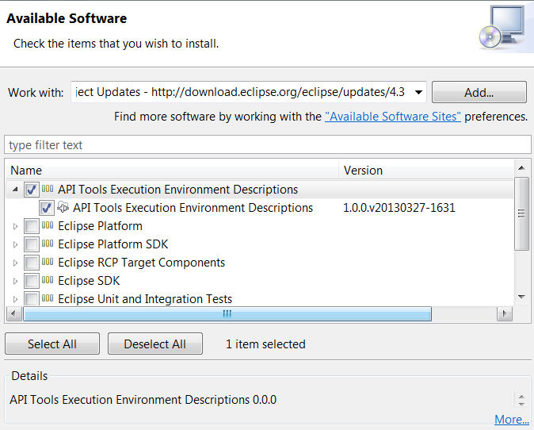

## What are Execution Environments?

Execution environments (EEs) are symbolic representations of JREs. 
For example, rather than talking about a specific JRE, with a specific name at a specific location on your disk, you can talk about the JavaSE-1.8 execution environment.
The system can then be configured to use a specific JRE to implement that execution environment.

Execution environments are relevant both to development (compile) time and runtime.

## So what does this mean to me and my bundles?

Good bundles have minimal dependencies. 
This allows them to be used in a wider range of situations and results in a smaller overall footprint for applications built of these bundles. 
The execution environment needed by your bundle is key in both situations.

Consider the different outcomes for some bundle A that requires just Foundation 1.0 and a bundle B that requires JavaSE-1.8. 
First, A can be used in embedded devices where Foundation 1.0 is quite popular. 
Second, an application written entirely of bundles such as A can ship on a Foundation 1.0 JRE. 
This results in a huge disk/transfer footprint savings over JavaSE-1.8 JREs!

## How can this be configured?

[OSGi](https://en.wikipedia.org/wiki/OSGi) allows bundles to be marked with the minimum execution environment they require (see the [ Setting the
Execution Environment](#setting-the-execution-environment)).
Setting this value has two effects.

1.  The compiler attempts to compile your bundle against the JRE
    associated with the EE you choose. For example, if you set your EE
    to be JavaSE-21, then the compiler will help you stick to that and
    not let you use APIs which exist in other class library versions. If
    you choose to increase your EE level, then you are forced to
    explicitly do so, rather than finding out later that you did it
    accidentally by referencing new APIs.
2.  The Equinox runtime will refuse to resolve/run your bundle if the
    current running JRE does not meet the minimum standard you
    specified. For example, if you attempt to install bundle B from
    above (requires JavaSE-21) on a system running Foundation 1.0, B will
    not resolve or run.

This page describes how Execution Environments are defined within the PDE environment.

## Which Execution Environment should I use?

**This section is outdated. 
The general consensus today with more frequent Java releases is to keep EE more up to date for developer productivity.
See also [SimRel Release Requirements for Execution Environment](https://github.com/eclipse-simrel/.github/blob/main/wiki/SimRel/Simultaneous_Release_Requirements.md#execution-environment)**

As discussed above, you should seek to use the smallest EE which give you all the features you require. 
Practically speaking, when creating a new OSGi bundle JavaSE-17 is a reasonable starting point. 
Lower EE settings are only practical in very specialized applications. 
If your particular bundle requires capabilities from a later EE, then specify a higher EE, but keep in mind this may limit adoption of your bundle for applications using an older Java runtime.

Once a particular EE has been chosen, it should be left alone unless there is a clear advantage to moving up. 
Increasing your EE can create a lot of work with no real value, such as exposing your code to new warnings, deprecations, etc.

Projects should not leave these choices to chance. 
Dependency structures are key parts of an architecture. 
For example, the [Eclipse Project](https://eclipse.org/eclipse) has explicitly identified EEs for all of their bundles. 
These choices are documented in the [project plan](https://www.eclipse.org/projects/project-plan.php?projectid=eclipse#appendix).
The execution environment listed in the table is based on the needs of the bundle and the expected use scenarios for the bundle.

## I have prerequisites that require version X to run, so shouldn't I require version X too?

No. You should seek to use the smallest BREE (Bundle-RequiredExecutionEnvironment) possible. 
There's several reasons to use a BREE smaller than your prerequisites. 
One is just sound architecture. 
Things might change in the future, so you want to code your bundle based on your needs. 
Maybe that prerequisite will be refactored out next release. 
Similarly, you do not (normally) have control over your prerequisites BREEs. 
They might lower theirs, they might raise it ... no reason to hard code some assumption in your bundle, based on your prerequisites.

Another reason for staying at a lower BREE (or at least not exposing types from a later BREE in your bundle's APIs) is to avoid compilation errors / maintenance overhead in downstream bundles. 
Example: If one of your API types implements java.lang.Iterable from J2SE-1.5, then this forces all dependent bundles to move to J2SE-1.5 as well -- otherwise, they don't compile any more (although the interface addition may be binary compatible).

## Setting the Execution Environment

1.  Use Eclipse-SDK 3.2.x or later.
2.  Right click on your bundle's `MANIFEST.MF` and select **Open With...
    \> Plug-in Manifest Editor**.
3.  Select the **Overview** tab.
4.  Note the section in the lower left corner entitled **Execution
    Environments**.
5.  Add your appropriate environment(s) noting the [special
    cases](#special-cases) below.
6.  Save the file.
7.  Select the link "update the classpath and compiler compliance
    settings".
8.  Ensure you have no compiling errors in your workspace.  
    Remember, for the BREE's to correctly effect compile errors in the
    workbench, you must have the proper `Execution Environments` defined
    under `Installed JREs` in your workbench preferences. It is quite
    normal to have 3 or more JREs installed such as for `J2SE-1.4`,
    `J2SE-1.5`, and `JavaSE-1.6`.
9.  Release your changes to the repository.

## Special cases

### Foundation class libraries

Bundles that require just Foundation 1.0 should in fact list Foundation
1.0 **and** J2SE-1.3 in their execution environments. This is because
Foundation 1.0 is not a proper subset of 1.3 (it includes some
additional javax.microedition classes). Listing them both in essence
says that only the intersection of the two EEs is valid for use in the
bundle. The situation is the same for Foundation 1.1 and J2SE-1.4.

### Compiling against more than is required

In some cases, a bundle may optionally use function from newer execution
environments if available but fall back to some other behaviour if not.
Such bundles must be compiled against the maximum EE actually used in
their code. For instance, the `org.eclipse.osgi` bundle uses
`java.nio.*` classes from J2SE-1.4 if available. It can however run
against the OSGI/Minimum-1.0 EE. As a result, it must be compiled
against J2SE-1.4.

In these cases you must list both the EE required for compilation and
the absolute minimum EE for runtime in the **Execution Environment**
section of the bundle **Overview**. The EE needed for compilation
against must appear **first** in the list. So for `org.eclipse.osgi`,
the list (in order) is *J2SE-1.4* then *OSGI/Minimum-1.0*.

### XML and other optional JRE pieces

You must distinguish between core parts of a JRE and optional parts. For
example, the XML support is not a core part of the class libraries until
J2SE-1.4. There are in fact many ways to get XML support added to almost
any execution environment.

While you can gain access to these classes by specifying the related EE,
that overly restricts your bundles. The better approach is to ignore
this type of class when choosing the minimum EE for your bundle and
instead specify Import-Package clauses in the manifest.mf of your
bundle. The IDE and runtime will then find other bundles that export the
needed packages and wire the bundles together.

This approach allows, for example, a bundle listing the J2SE-1.3 EE to
use XML function as long as there is another bundle that provides (i.e.,
exports) the XML APIs.

**Compiling:** If you have your EE set to be one (like Foundation 1.0)
which doesn't provide the XML APIs, then in order to compile and run you
need to retrieve a bundle that provides these APIs such as `org.w3c.dom`
from Maven (perhaps via [Orbit](https://github.com/eclipse-orbit).
**Running:** If you are running your application with a (for instance)
Foundation VM and you have a bundle which provides the XML APIs, you
need to set the following system propery:
`-Dosgi.framework.extensions=org.w3c.dom` to make OSGi aware of the XML
code.

## Managing Execution Environments

For the most part the Eclipse IDE manages the execution environments for
you. You do however have to have the relevant JREs installed on your
machine and configured into your IDE.

Most JREs can be acquired from Oracle via their
[main web site](https://www.oracle.com/us/java/) or their [handy
archive
site](https://www.oracle.com/technetwork/java/archive-139210.html). Note
that the best source for suitable Foundation 1.\* JREs is IBM's J9. See
[ Getting J9](https://eclipse.dev/openj9/) for more details.

When you install a new JRE, the IDE analyzes the function it provides
and identifies the set of EEs it can support. The IDE distinguishes
between **exact matches** for an EE and compatible matches. You can see
all the execution environments and the JREs they match by looking at
**Window \> Preferences \> Java \> Installed JREs \> Execution
Environments**.

If you do not have an exact match for an EE that is specified in one of
your bundles but do have a compatible match, you get a warning.
Continuing development runs the risk of using API which will not be
present at runtime. If you have neither an exact or compatible match,
your bundle's project will fail to compile.

## Standard Execution Environments

The set of execution environments is extensible but the Eclipse IDE
includes support for the environments set out in the OSGi R4
specification. These are summarized in the table below.

| EE Name                    | Description                                                                                                                                                        |
|----------------------------|--------------------------------------------------------------------------------------------------------------------------------------------------------------------|
| **OSGi/Minimum-1.0**       | OSGi Minimum Execution Environment 1.0 - This is a subset of the J2ME Foundation 1.0 class libraries defined by OSGi to be the base for framework implementations. |
| **OSGi/Minimum-1.1**       | OSGi Minimum Execution Environment 1.1 - This is a subset of the J2ME Foundation class libraries defined by OSGi to be the base for framework implementations.     |
| **CDC-1.0/Foundation-1.0** | J2ME Foundation 1.0 - With the exception of some MicroEdition IO classes, Foundation 1.0 is a subset of J2SE 1.3.                                                  |
| **CDC-1.1/Foundation-1.1** | J2ME Foundation 1.1 - With the exception of some MicroEdition IO classes, Foundation 1.1 is a subset of J2SE 1.4.                                                  |
| **JRE-1.1**                |                                                                                                                                                                    |
| **J2SE-1.2**               |                                                                                                                                                                    |
| **J2SE-1.3**               |                                                                                                                                                                    |
| **J2SE-1.4**               |                                                                                                                                                                    |
| **J2SE-1.5**               |                                                                                                                                                                    |
| **JavaSE-1.6**             |                                                                                                                                                                    |
| **JavaSE-1.7**             |                                                                                                                                                                    |
| **JavaSE-1.8**             |                                                                                                                                                                    |

## Installing Execution Environment Descriptions

Latest Execution Environment Descriptions can be installed from the release update site, for example:

[Eclipse 4.3 update site](https://download.eclipse.org/eclipse/updates/4.3)  
When using the 4.3 Kepler update site the environments are contained in
a single installable unit labelled "API Tools Execution Environment
Descriptions" inside a category of the same name. Previous releases
provided each execution environment description as a separate
installable unit.

## External Links

[How to setup some plugins to use java 1.5 in a java 1.4 workspace? (A
step by step explanation by Michael
Scharf)](https://michaelscharf.blogspot.com/2006/07/how-to-setup-some-plugins-to-use-java.html)

