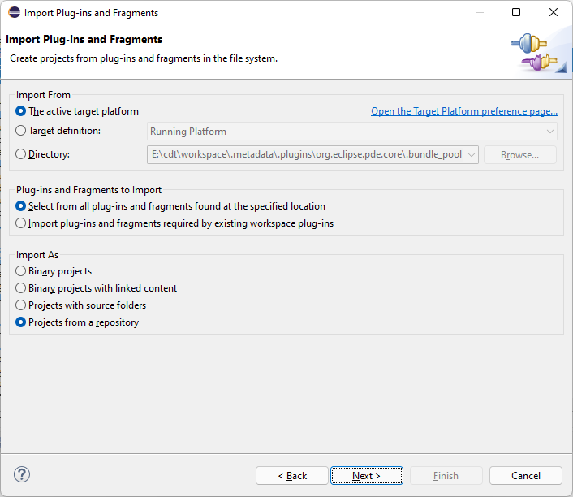
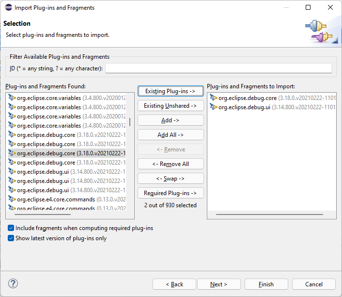
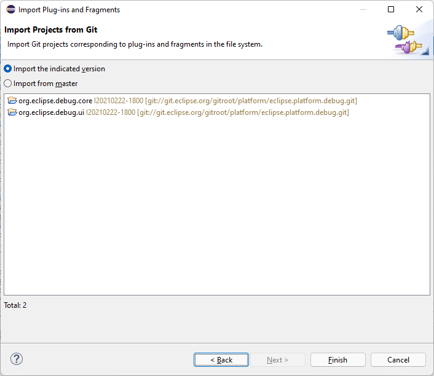

# PDE/UI/SourceReferences

## Eclipse Source Reference Headers

PDE supports **Eclipse-SourceReferences** headers to bundle manifests.
The header provides a list of [SCM URLs](http://maven.apache.org/scm/scm-url-format.html) that reference the source code associated with a binary bundle.
PDE build has extensible support for generating source reference headers and the IDE supports importing projects into the workspace corresponding to headers.
Usually a bundle has only one SCM URL associated with it.
For example, following is a header included in the `org.eclipse.debug.ui` bundle from the Eclipse 4.19 release:

```text
Eclipse-SourceReferences: scm:git:git://git.eclipse.org/gitroot/platform/eclipse.platform.debug.git;path="org.eclipse.debug.ui";tag="I20210222-1800";commitId=c239e1061cd3e02c6e3cb7f34b2be0be7fea7355
```

Support to generate headers and import from different repositories is extensible.
The Eclipse SDK provides support for Git via the eGit project.

## Importing Projects from Git

The SCM URLs generated in the Eclipse SDK refer to projects in the Eclipse GIT repository.
To import projects from GIT use PDE's import wizard (use the **File > Import** action and select **Plug-in Development > Plug-ins and Fragments** on the first page of the import wizard).
For this example, we'll import from the active target platform.
Choose the **Projects from a repository** radio button at the bottom of the wizard page and press **Next**.



All bundles with published SCM URLs will be available for importing.
Select the bundles you want to import, and press **Next**.
For this example, I have selected bundles related to the debug platform.



The last page of the wizard allows you to import the specific versions of the projects that were used in the build or from latest version.
Pressing **Finish** imports the projects into the workspace, connected to the GIt repository.



## Extensibility: Generating and Importing Source Reference Headers

PDE build optionally generates source reference headers during a build.
This feature is turned on by specifying the following property:

```properties
generateSourceReferences = true
```

The headers themselves are generated by **fetch factories**.
PDE build uses fetch factories to fetch source code from repositories (there is an **org.eclipse.pde.build.fetchFactories** extension point).
Each repository (CVS, etc.), provides a specific implementation of an **IFetchFactory**.
To include source reference headers a fetch factory must provide a **KEY_SOURCE_REFERENCES** property when parsing a map file entry, in the implementation of **parseMapFileEntry(String, Properties, Map)**.

For example, the CVS fetch factory implementation sets a {key, value} pair in the map for each project being fetched, like:

```text
{"sourceReferences", "Eclipse-SourceReferences: scm:cvs:pserver:dev.eclipse.org:/cvsroot/eclipse:org.eclipse.debug.core;tag=v20100427"}
```

PDE provides two new **experimental / internal** extension points to support import operations in the SDK:

* _org.eclipse.pde.core.bundleImporters_ - A bundle importer is capable of creating a project in the workspace based on specific entries contained in a bundle manifest (implements **org.eclipse.pde.internal.core.importing.provisional.IBundleImporterDelegate**).
  A bundle importer is provided with the manifest (map of header value pairs) of each bundle.
  For each bundle that the importer supports, it creates and returns a bundle import description (org.eclipse.pde.internal.core.importing.provisional.BundleImportDescription).
* _org.eclipse.pde.ui.bundleImportPages_ - A bundle import page provides a wizard page used in the Plug-in import wizard to configure settings for bundles to be imported by a bundle importer extension (implements **org.eclipse.pde.internal.ui.provisional.IBundeImportWizardPage**).
  The page is provided with any bundle import descriptions associated with bundles the user has selected for import.
  The page can then modify/annotate/further restrict the bundle import descriptions.
  The resulting importing descriptions are passed to the bundle importer when finish is pressed.

Since the extension points are experimental the interfaces implemented by the extensions are in the internal (non-API) namespace.
The SDK provides implementations of all three extensions for CVS.
For example, the CVS bundle import page adds information to bundle import descriptions if the user decides to import from HEAD.
The eGit projects provides implementations for Git.

### Generating Source Reference Headers with Tycho

Source reference headers can also be generated with Tycho with [tycho-packaging:package-plugin](https://www.eclipse.org/tycho/sitedocs/tycho-packaging-plugin/package-plugin-mojo.html).

For example, if a project is located in Eclipse's Git repos add a property with the SCM URL like this:

```xml
<properties>
    <tycho.scmUrl>scm:git:git://git.eclipse.org/gitroot/cdt/org.eclipse.cdt.git</tycho.scmUrl>
</properties>
```

For a repository located on GitHub the equivalent property would look like:

```xml
<properties>
    <tycho.scmUrl>scm:git:https://github.com/eclipse/january.git</tycho.scmUrl>
</properties>
```

Then add the packaging plug-in to the build:

```xml
<build>
    <plugins>
        <plugin>
            <groupId>org.eclipse.tycho</groupId>
            <artifactId>tycho-packaging-plugin</artifactId>
            <version>${tycho-version}</version>
            <dependencies>
                <!-- Use jgit to resolve source references for git: type SCM -->
                <dependency>
                    <groupId>org.eclipse.tycho.extras</groupId>
                    <artifactId>tycho-sourceref-jgit</artifactId>
                    <version>${tycho-extras-version}</version>
                </dependency>
            </dependencies>
            <configuration>
                <sourceReferences>
                    <!-- Generate the source reference in the MANIFEST.MF -->
                    <generate>true</generate>
                </sourceReferences>
            </configuration>
        </plugin>
    </plugins>
</build>
```
