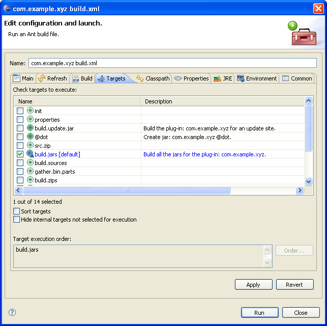
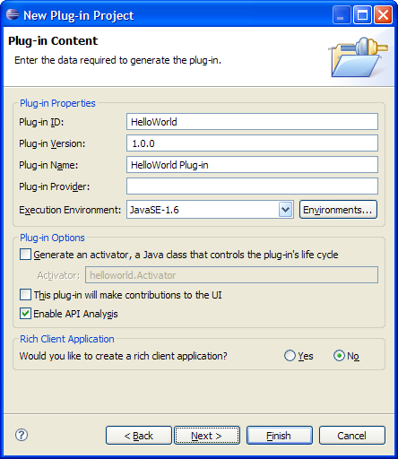
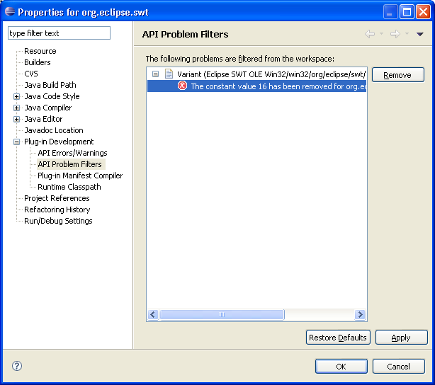
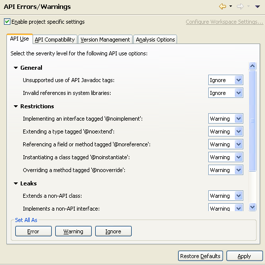
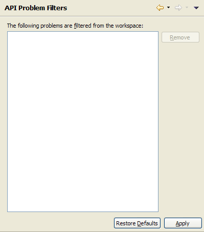

PDE/User Guide
==============

Community members are encouraged to maintain the page, and make sure the information is accurate.
  

Getting Started
===============

PDE Overview
------------

The Plug-in Development Environment (PDE) provides tools to create, develop, test, debug, build and deploy Eclipse plug-ins, fragments, features, update sites, and RCP products.

PDE also provides comprehensive OSGi tooling, which makes it an ideal environment for component programming, not just Eclipse plug-in development.

PDE is broken into three main components:

*   UI - A rich set of models, tools, and editors to develop plug-ins and OSGi bundles
*   API Tooling - Tooling to assist API documentation and maintenance
*   Build - Ant-based tools and scripts to automate build processes

**PDE UI**

PDE UI provides editors, wizards, launchers, views, and other tools to create a fully-featured environment to develop and deploy Eclipse plug-ins, fragments, features, update sites, RCP products, and OSGi bundles.

Some of the PDE tools include:

*   **Form-Based Manifest Editors**: Multi-page editors that centrally manage all manifest files of a plug-in or feature.
*   **RCP Tools**: Wizards and a form-based editor that allow you to define, brand, test, and export products to multiple platforms.
*   '_New Project Creation Wizards_: Create a new plug-in, fragment, feature, feature patch, and update sites.
*   **Import Wizards**: Import plug-ins and features from the file system.
*   **Export Wizards**: Wizards that build, package, and export plug-ins, fragments, and products with a single click.
*   **Launchers**: Test and debug Eclipse applications and OSGi bundles.
*   **Views**: PDE provides views that help plug-in developers inspect different aspects of their development environment.
*   **Miscellaneous Tools**: Wizards to externalize and clean up manifest files.
*   **Conversion Tools**: Wizard to convert a plain Java project or plain JARs into a plug-in project.
*   **Integration with JDT**: Plug-in manifest files participate in Java search and refactoring.

To get started, try out the following cheat sheets:

*   **Creating an Eclipse Plug-in**
*   **Creating a Rich Client Application**

**PDE API Tooling**

PDE API Tooling assists in the documentation and maintenance of APIs provided by plug-ins and OSGi bundles.

Some of the features include:

*   **Compatibility Analysis** : Identify binary compatibility issues relative to a previous version of a plug-in.
*   **API Restriction Tags** : Javadoc tags are provided to explicitly define restrictions associated with types and members.
*   **Version Number Validation**: Identify invalid plug-in version numbers relative to a previous version of a plug-in.
*   **Javadoc `@since` Tag Validation**: Identify missing and invalid `@since` tags on types and members.
*   **API Leak Analysis** : Identify API types and methods that leak non-API types.
*   **Quick Fixes** : Quick fixes are provided to adjust plug-in versions and @since tags appropriately.

**PDE Build**

PDE Build facilitates the automation of plug-in build processes. 
PDE Build produces Ant scripts based on development-time information provided by, for example, the plugin.xml and build.properties files. 
The generated Ant scripts, can fetch the relevant projects from a CVS repository, build jars, Javadoc, source zips, put everything together in a format ready to ship, and send it out to a remote location (e.g., a local network or a downloads server).

PDE build is not actively enhanced anymore as the platform moved to a Maven Tycho build.

Concepts
========

Extensions and Extension Points
-------------------------------

A basic rule for building modular software systems is to avoid tight coupling between components. If components are tightly integrated, it becomes difficult to assemble the pieces into different configurations or to replace a component with a different implementation without causing a ripple of changes across the system.

Loose coupling in Eclipse is achieved partially through the mechanism of extensions and extension points. The simplest metaphor for describing extensions and extension points is electrical outlets. The outlet, or socket, is the extension point; the plug, or light bulb that connects to it, the extension. As with electric outlets, extension points come in a wide variety of shapes and sizes, and only the extensions that are designed for that particular extension point will fit.

When a plug-in wants to allow other plug-ins to extend or customize portions of its functionality, it will declare an extension point. The extension point declares a contract, typically a combination of XML markup and Java interfaces, that extensions must conform to. Plug-ins that want to connect to that extension point must implement that contract in their extension. The key attribute is that the plug-in being extended knows nothing about the plug-in that is connecting to it beyond the scope of that extension point contract. This allows plug-ins built by different individuals or companies to interact seamlessly, even without their knowing much about one another.

The Eclipse Platform has many applications of the extension and extension point concept. Some extensions are entirely declarative; that is, they contribute no code at all. For example, one extension point provides customized key bindings, and another defines custom file annotations, called markers; neither of these extension points requires any code on behalf of the extension.

Another category of extension points is for overriding the default behavior of a component. For example, the Java development tools include a code formatter but also supply an extension point for third-party code formatters to be plugged in. The resources plug-in has an extension point that allows certain plug-ins to replace the implementation of basic file operations, such as moving and deletion.

Yet another category of extension points is used to group related elements in the user interface. For example, extension points for providing views, editors, and wizards to the UI allow the base UI plug-in to group common features, such as putting all import wizards into a single dialog, and to define a consistent way of presenting UI contributions from a wide variety of other plug-ins.

Feature
-------

A **feature** is used to package a group of plug-ins together into a single installable and updatable unit.

Features have a manifest that provides basic information about the feature and its content. Content may include plug-ins, fragments and any other files that are important for the feature. A feature can also include other features. The delivery format for a feature is a JAR, but each included plug-in will be provided as a separate JAR.

Once you have created your plug-ins and fragments you can create a new feature by creating a New Feature Project.

You can also create Feature Patches in PDE. A feature patch is developed in the same fashion as a normal feature, but is used to edit an existing feature rather than create a new one.

Fragment
--------

A **fragment** is used to replace or extend the functionality of an existing plug-in. A common use for fragments is to put environment (operating system, architecture, etc.) specific code into fragments. Depending on the environment the plug-in is installed in the base plug-in code along with the correct fragment can be installed. Fragments are also ideal for shipping features like language or maintenance packs that typically trail the initial products for a few months.

When a fragment is detected by the platform and its parent plug-in is found, the fragment's libraries, extensions and extension points are "merged" with those of the parent plug-in.

While this merging mechanism is good from a runtime point of view, developers need to view fragments as separate entities while working on them.

PDE provides full support for fragment development. Fragments can be viewed as "limited plug-ins". They have all of the capability of regular plug-ins but have no concept of life-cycle. Fragments have no top-level class with "startup" and "shutdown" methods.

To create a fragment use the New Fragment Project wizard. Editing fragments is very similar to editing plug-ins.

Plug-in
-------

A **plug-in** is used to group your code into a modular, extendable and sharable unit.

Plug-ins are modular as each plug-in contains some portion of code. The plug-in specifies other plug-ins (or java packages) it requires to be available to run and it also specifies the set of java packages it provides. An Eclipse based program or product will contain multiple plug-ins, which can be added, replaced or removed to alter the functionality of the program.

Plug-ins are extendable using extensions and extension points. A plug-in can provide one or more extension points so other plug-ins can add to the functionality of the plug-in. A plug-in may also provide extensions to connect to other plug-ins.

Plug-ins are sharable. A plug-in can be exported as a directory or as a jar which can be added to other applications. Plug-ins can be grouped into features which can be distributed and installed into applications.

Eclipse plug-ins are based on OSGi bundles. OSGi is used to manage the plug-ins in an Eclipse application. A plug-in must contain a manifest file with valid OSGi headers for plug-in name and version. Extensions and extension points functionality added by Eclipse in addition to OSGi. To use extensions you must provide a plugin.xml file. PDE provides a full featured project and editor for creating and editing these files.

Product
-------

An Eclipse based product is a stand-alone program built with the Eclipse platform. A product may optionally be packaged and delivered as one or more features, which are simply groupings of plug-ins that are managed as a single entity by the Eclipse update mechanisms.

Products include all the code and plug-ins needed to run them. This includes a Java runtime environment (JRE) and the Eclipse platform code. The plug-in code, JRE, and Eclipse platform are typically installed with a product-specific installation program. Product providers are free to use any installation tool or program that is appropriate for their needs.

Once installed, the user launches the product and is presented with an Eclipse workbench configured specifically for the purpose supported by the product, such as web development, C++ program development, or any other purpose. The platform makes it easy to configure labels, about dialogs, graphics, and splash screens, so that the user has no concept of a platform workbench, but instead views the workbench as the main window of the product itself.

PDE provides a product configuration file and associated editor to make it easy to create products in the correct format.

Target Platform
---------------

The Target Platform refers to the plug-ins which your workspace will be built and run against. It describes the platform that you are developing for. When developing with PDE, the target platform is used to:

*   Compile - Plug-ins in the workspace are built against the target platform so you do not have to have everything in your workspace
*   Launch - When using PDE's launchers you can choose the set of plug-ins you want to launch. By default the Eclipse Application Launcher will start with all plug-ins in the target, but will use workspace plug-ins instead when available
*   Calculate Dependencies - PDE assists you in finding the plug-ins your plug-ins was include/require to compile correctly by looking at what is available in the target platform
*   State - An OSGi state is created for the target platform so it can be used by other tooling. The state can also be viewed in detail using the Target Platform State View
*   Other Tools - Other PDE tools use the target platform to determine their options, such as the import wizards

Whereas the target platform refers to your currently active bundles, a Target Definition is a way of determining the plug-ins to add to the state. You can have multiple target definitions, but only one definition can be selected as the target platform.

The target platform and your target definitions are managed on the Target Platform Preference Page. This page lists all target definitions that PDE has access to and displays which definition is being used as your current target platform. Target definitions can be created and edited here using the Target Definition Content Wizard. To make for easier sharing among a development team, targets can also be created and edited in the workspace as xml files with the extension ".target". These files can be edited using the target definition editor and can be created using the New Target Definition Wizard.

By default PDE provides a default target platform which simply points to the plug-ins in your currently running Eclipse instance (often referred to as your host). For Eclipse plug-in developers this might be all you need. RCP developers must be more careful managing their target as adding dependencies increases the size and complexity of their application. When creating a new target definition for RCP, consider using the RCP template (available with or without source).

See https://github.com/eclipse-pde/eclipse.pde/blob/master/docs/Target_Definitions.md

Update Site
-----------

**Update Sites** are used to organize and export features so they can be installed into Eclipse applications.

To create an update site you must develop a site.xml file and build the site. PDE provides an editor and project for creating sites. A site will contain one or more features organized into categories.

When the site is built, the included features (along with all plug-ins part of those features) will be exported into an installable form. The exported plug-ins and features will be put into two folders "plugins" and "features". Two other files, "content.xml" and "artifacts.xml" will also be generated and contain metadata for the exported files that make installing easier. These files, along with "site.xml", collectively form an Eclipse update site. To make the update site available to others you must make all these files available in a shared directory or web site.

Tasks
=====

PDE Build
---------

### Automated building of Products

PDE Build comes with infrastructure to build a complete RCP application from a product configuration file. Most of the setup necessary for such a build can be done through a few modifications to the template build.properties provided in PDE build. The following section focuses on setting up a simple product build assuming that all plug-ins and features (both to build and pre-built) referenced by the product file are already locally available on disk.

**Basic setup**

The first step in setting up a build is to create the directory in which the build will take place. This directory will be referred to as the build directory and will contain the plug-ins and features to build as well as all the generated artifacts. Next, copy your plug-ins and features respectively into "plugins" and "features" subdirectories. Your product configuration file is expected to be in one of these plugins/features.

The second step in setting up a build is to copy the template build.properties file from org.eclipse.pde.build/templates/headless-build to a new directory which will be the build configuration directory (also referred to as the configuration directory). Edit the copied build.properties file and set the following properties:

*   **product**: the location of your product configuration file in the form "/<plugin or feature id>/path/to/.product"
*   **baseLocation**: the location of an eclipse install containing all the pre-built features and plug-ins that your product requires in features/ and plugins/ subdirectories. The RCP delta pack (it is * available from the eclipse download page) is mandatory as it includes the org.eclipse.platform.launchers feature which contains the launchers and root files necessary for a product.
*   **buildDirectory**: the directory the build will take place in. Set this to the full path of the build directory created previously.
*   **configs**: list the configurations for which you want your product to be built. You can uncomment the configuration(s) provided (be careful of the line continuations).
*   **archivePrefix**: the name of the directory of your product once installed on disk.

**Overview of the directory structure**

		<buildDirectory>/
		 plugins/
		  pluginToBuildA
		  pluginToBuildB
		 myProduct.product
		  ...
		 features/
		  featureToBuild
		  ...
		<buildConfiguration>/
		 build.properties
		<baseLocation>
		 plugins/
		  org.eclipse.core.runtime
		  org.eclipse.ui
		   ...
		 features/
		  org.eclipse.rcp
		  org.eclipse.platform.launchers
		  ...

**Running the build**

To run the build you will use the org.elipse.ant.core.antRunner application. When invoking eclipse with this application to perform a build you need to set two arguments on the command line:

*   -buildfile </path/to/productBuild.xml>: This is the path to the productBuild.xml provided by pde build. It is located in the org.eclipse.pde.build/scripts/productBuild directory. This is the build file that drives the whole product build process.
*   -Dbuilder=</path/to/configuration folder>: This is the path to the build configuration folder.

Run the antRunner application using the following command:

		java -jar eclipseInstall/plugins/org.eclipse.equinox.launcher_version.jar
		 -application org.eclipse.ant.core.antRunner
		 -buildfile eclipseInstall/plugins/org.eclipse.pde.build_version/scripts/productBuild/productBuild.xml
		 -Dbuilder=path to the build configuration folder

**Advanced Scenarios**

Behind the scenes this setup will generate a feature containing the plugins or features specified in your product configuration file. This generated feature is then used to drive a normal feature-based headless build. If you require more customization of the build, ie fetching from a repository, see the Advanced PDE Build topics for more information.

### Automated building of Features

PDE Build comes with infrastructure to automate the build of features. Most of the setup necessary for such a build can be done through a few modifications to the template build.properties provided in PDE build. The following section focuses on setting up a simple build assuming that all plug-ins and features (both to-build and pre-built) referenced from the feature being built are already locally available on disk.

**The Build Configuration Directory**

The first step in setting up a build is to create the build configuration directory. This is the directory in which the files that control and customize the headless build are kept.

The main file for controlling the build is the top level build configuration build.properties file. When setting up a new build, copy the template file from the org.eclipse.pde.build bundle in your eclipse install that you will be using to run your build. The template file is located under org.eclipse.pde.build/templates/headless-build/build.properties.

This directory is refered to by the builder properties which is normally set on the ant command line.

**The buildDirectory**

The buildDirectory property specifies the directory in which PDE/Build will generate scripts and perform the actual build. Plug-ins and features that are being built should placed in ${buildDirectory}/plugins and ${buildDirectory}/features sub-directories. If bundles and features are being fetch from a repository (See Fetching From Repositories), then they will be placed here as well.

This directory may be the same as the build configuration directory, or it may be a different directory. It may be desirable to use a separate directory, especially if the build configuration is kept in CVS and you don't want to pollute it with generated build artifacts.

**Initial Properties**

To set up a basic feature build, you need to edit the build configuration build.properties file and set the following properties:

*   topLevelElementId: Set to the id of the feature you wish to build.
*   baseLocation: the location of an eclipse install containing pre-built features and plug-ins in features/ and plugins/ subdirectories. These are the binaries against which you will be compiling. *If you have no pre-requisite binaries and are building everything from scratch, this property can be left un-set.
*   buildDirectory: the directory the build will take place in.
*   configs: list the configurations for which you want your feature to be built. You can uncomment the configuration(s) provided (be careful of the line continuations). If the feature you are \*building is platform independent, this property does not need to be set or can be set to \*,*,*.
*   archivePrefix: the name of the directory in which your feature will be unzipped on disk.

Previous versions of PDE/Build also required an allElements.xml file, this is no longer necessary in 3.4. The allElements.xml can still be used, but is only required if you wish to customize certain aspects of your build. See Customizing a Headless Build.

**Running the build**

To run the build you will use the org.elipse.ant.core.antRunner application. When invoking eclipse with this application to perform a build you need to set two arguments on the command line:

*   -buildfile=</path/to/build.xml>
    *   This is the path to the build.xml provided by pde build. It is located in the org.eclipse.pde.build/scripts directory. This is the build script that drives the whole build process.
*   -Dbuilder=</path/to/configuration folder>
    *   This is the path to the build configuration folder.

Run the antRunner application using the following command:

		java -jar <eclipseInstall>/plugins/org.eclipse.equinox.launcher_<version>.jar 
		 -application org.eclipse.ant.core.antRunner 
		 -buildfile <<eclipseInstall>/plugins/org.eclipse.pde.build_<version>/scripts/build.xml> 
		 -Dbuilder=<path to the build configuration folder>

Once the build is complete, you can get the result in the build directory in the folder named I.TestBuild (this name can be configured by setting the buildLabel property).

**Advanced scenarios**

If you require more customization of the build, ie fetching from a repository, see the Advanced PDE Build topics for more information.

### Automated building of Plug-ins

In order to build plug-ins, bundles or fragments, PDE build requires that you create a feature listing all the elements to be built. In this case the feature is only used to drive the build and will not be present in the final archive nor will it force you to use update sites.

A feature used to drive a plug-in build is a standard feature. What makes it different is that its build.properties file does not contain the property bin.includes. It is possible to automatically generate a feature containing the plug-ins you wish to build. This lets you build your plug-ins without requiring you to maintain a feature. See the eclipse.generateFeature task and the Customizing a Headless Build page.

Example:

		build.properties:  topLevelElementId = acme.build.feature
		customTargets.xml : 
			<target name="preSetup">
				<eclipse.generateFeature
					featureId="acme.build.feature"
					buildDirectory="${buildDirectory}"
					baseLocation="${baseLocation}"
					productFile="${product}"
					verify="false"
					pluginPath="${pluginPath}"
					configInfo="${configs}"
					pluginList="acme.plugin.A,acme.plugin.B"
					featureList="${featureList}"
					includeLaunchers="false"
				/>
			</target>

Once you have created the feature to drive the build, follow the instructions on building features.

### Generating Ant scripts

Ant is a simple open-source scripting engine that is capable of running scripts written in XML format. Ant is ideal for executing tasks usually found in automated builds.

The variables set in the plug-in, fragment or feature build.properties will be used to generate scripts for Ant. PDE generates Ant scripts for creating individual plug-in and fragment build files and one overall script for building the feature JAR. This "main" script is also responsible for running individual script files in the right order (defined by the plug-in dependency chain). Each build file has the same name (build.xml) and is created as a sibling of the manifest files in the corresponding projects.

Since Ant scripts use the replacement variables in build.properties, you can typically use them "as is", without modifying the generated scripts. If you do modify them, you must not recreate the scripts every time you want to rebuild the component.

To create scripts, you can simply select **Create Ant Build File** while a suitable manifest file (plugin.xml, fragment.xml or feature.xml) is selected in the Navigator or Package Explorer views. The command will generate the build script. After selecting Run Ant... from the pop-up menu while the newly generated script file is selected, the following wizard will open:

The standard Ant wizard allows customization in two ways: by providing the execution arguments and by selecting one or more build targets.

**Properties**

Ant arguments are typically used to provide property values that override default values and control the build process. Arguments are set using "-Dproperty=value". The following properties are recognized:

*   bootclasspath - if set, it replaces the default boot classpath. Used when compiling cross-platform plug-ins (e.g. building a UI plug-in for Windows using Linux)
*   build.result.folder - where the temporary files for the update JAR creation should be placed. These files are usually the plug-in library JARs.
*   plugin.destination - where plug-in and fragment update JARs should be put. These JARs represent entire plug-ins and fragments in a format suitable for publishing on an Install/Update server and referencing by a feature. The typical layout of an Update site is to have all the plug-in and fragment JARs in one place and all the features in another. This argument is useful for placing plug-ins and fragment directly into the desired directory (or the staging place on the local machine before pushing the features onto the remote server).
*   feature.destination - where feature update JARs should be put.

To adapt the behavior of the compiler, the following properties are recognized:

*   javacFailOnError - stop the build when an error occurs when set to true. Default is false.
*   javacDebugInfo - compile source with debug information when set to true. Default is true.
*   javacVerbose - produce verbose output when set to true. Default is true.
*   javacSource - value of the -source command-line switch.
*   javacTarget - generate class files for specific VM version.
*   compilerArg - additional command line arguments for the compiler.

**Targets**

When executing feature build scripts, the following targets are used to call individual targets of plug-ins or fragments. In order to specify what target to execute, the property target should be set (e.g. -Dtarget=refresh). One of the all.* targets serves as an iterator, whereas the actual target to execute is specified via the property target.

*   all.plugins - for all listed plug-ins
*   all.fragments - for all listed fragments
*   all.children - for all listed plug-ins and fragments
*   build.jars - build JARs for all feature children;
*   build.sources - build source for all feature children;
*   build.update.jar - generate a feature JAR in the format used by the install/update mechanism. The above mentioned property feature.destination can be used to define where to put the JAR;
*   zip.distribution - creates a zip file with the feature and its plug-ins and fragments in an SDK-like structure but does not include source code;
*   zip.sources - creates a zip file with the feature and its plug-ins and fragments in an SDK-like structure which only includes the source;
*   clean - delete everything produced by running any of the target;
*   refresh - performs a "Refresh" action in the current project, thus making the newly generated resources visible in the Navigator or Package Explorer.
*   zip.plugin - creates a zip file with the binary and source contents of a plug-in with the following structure:
    *   id_version/
        *   contents

### Generating Ant scripts from the command line

Ant scripts are typically generated using the Plug-in Development Environment (PDE), but it is also possible to generate them by hand or from other scripts. Indeed PDE exposes Ant tasks to generate the various build scripts. Build script generation facilities reside in the following tasks. Arguments are also listed for each task.

**eclipse.fetch**: generates an Ant script that fetches content from a CVS repository. The eclipse fetch is driven by a file whose format is described below.

*   **elements**: the entry that will be fetched. The format expected is of the form type@id\[,version\] as specified in the directory file format
*   **buildDirectory**: the directory into which fetch scripts will be generated and into which features and plug-in projects will be checked out
*   **directory**: the path to a directory file
*   **children**: optional, specifies whether the script generation for contained plug-ins and fragments should be invoked. Default is set to true
*   **cvspassfile**: optional, the name of a CVS password file.
*   **fetchTag**: optional, overrides the tag provided in directory file by the given value.
*   **configInfo**: optional, an ampersand separated list of configuration indicating the targeted configuration. The default is set to be platform independent.
*   **recursiveGeneration**: optional, specify whether or not fetch scripts should be generated for nested features. The default is set to true.

**eclipse.buildScript**: generates a build.xml file for the given elements as well as additional scripts used by the pde build infrastructure

*   **elements**: the entry to be built. Entry is expected to be of the form type@id\[,version\] as specified in the directory file format
*   **buildDirectory** :the directory where the features and plug-ins to build are located. Plug-ins and features must respectively be located in plugins and features folders;
*   **children**: optional, specifies whether the script generation for contained plug-ins and fragments should be invoked. Default is set to true
*   **recursiveGeneration**: optional, specified whether the script generation for contained features should be invoked. Default is set to true
*   **devEntries**: optional, a comma separated list of directories to be given to the compile classpath
*   **buildingOSGi**: optional, indicates if the target is 3.x. or 2.1. Default is true
*   **baseLocation**: optional, indicates a folder which containing a target eclipse install with features/ and plugins/ subdirectories
*   **configInfo**: optional, an ampersand separated list of configuration indicates the targeted configuration. The default is set to be platform independent
*   **pluginPath**: optional, a platform file separator separated list of locations from which to find additional plug-ins
*   **archivesFormat**: optional, an ampersand separated list of configs and the expected output format for each of those. The format is separated by a dash (-) from the configuration. The values supported are: folder, tar, zip, antZip, respectively meaning don't archive, use tar to create the archive, use the version of info zip available on the platform, use ant zip . The default value is antZip
*   **product**: optional, '/' separated path to the location of an RCP product being built. The first segment of the path must refer to the plug-in id of a plug-in containing the .product file;
*   **signJars**: optional, indicates if the scripts generated must sign jars for features and plug-ins. The default value is false. The parameters to the sign task are controlled by the following ant properties: sign.alias, sign.keystore and sign.storepass respectively being passed to the alias, keystore and storepass parameters from the ant signJar task. The default value is false
*   **generateJnlp**: optional, indicates if a jnlp file should be generated for all the features being built
*   **outputUpdateJars**: optional, generates plug-ins and features in the update site format when set. The default value is false. Note that the site.xml is not generated nor updated
*   **groupConfiguration**: optional, whether or not to group all configurations being built into a single archive
*   **generateVersionsLists**: optional, whether or not to generate properties files listing the versions of features and plug-ins that were built
*   **filteredDependencyCheck**: optional, constrain the set of plug-ins and features to be considered during the build to those reachable from the features
*   **filterP2Base**: optional, constrain the set of plug-ins and features to be considered from the baseLocation to those considered to be installed by p2
*   **generateFeatureVersionSuffix**: optional, whether or not to generate the feature version suffix. See also Version Qualifiers
*   **generatedVersionLength**: optional, the length of the generated feature version suffix. By default it is set to 28. See also Version Qualifiers
*   **significantVersionDigits**: optional, the number of significant digits used when generating feature version suffixes. See also Version Qualifiers
*   **forceContextQualifier**: optional, uses the given value to replace the .qualifier being by plug-ins and features. See also Version Qualifiers

**eclipse.generateFeature**: generates a feature that will contain the provided elements. This task is used to build an RCP application from a product configuration file.

*   **featureId**: The id to give to the generated Feature.
*   **buildDirectory**: the directory where the features and plug-ins (in /features and /plugins subdirectories) to include are located. The generated feature will be placed in the /features subdirectory.
*   **baseLocation**: optional, indicates a folder which contains installed features and plug-ins
*   **productFile**: optional, a product file on which to base the generated feature.
*   **verify**: Whether or not to use the resolver to verify that the provided plug-ins and features are available. This also determines whether or not the the feature will be able to correctly handle platform specific fragments and plug-ins that will be JARed. If all the elements to be included in the feature are available locally, then verify should be set to True. If the elements need to be fetched from a repository, set verify to False, use the resulting feature to fetch the required plug-ins and features, then regenerate the container feature using verify = True.
*   **pluginPath**: optional, a platform file separator separated list of locations from which to find additional plug-ins
*   **configInfo**: optional, an ampersand separated list of configuration indicates the targeted configuration. The default is set to be platform independent;
*   **pluginList**: optional, a comma separated list of plug-in ids to include in the generated feature. (Supports attributes, see below)
*   **featureList**: optional, a comma separated list of feature ids to include in the generated feature. (Supports attributes, see below)
*   **fragmentList**: optional, a comma separated list of fragment ids to include in the generated feature. (Supports attributes, see below)
*   **buildPropertiesFile**: optional, the location of a properties file whose contents should be used as the generated feature's build.properties.
*   **includeLaunchers**: optional, whether or not to include the equinox launchers, default value is "true".

The pluginList, featureList, and fragmentList arguments of the eclipse.generateFeature task all support attributes. These arguments all take the form:

		List = <element-id>\[;<attribute>=<value>\]* \[,<element-id>\[;<attribute>=<value>\]*\]*

Each attribute=value pair will be inserted into the generated xml corresponding to the given element. Example:

		featureList = org.eclipse.feature;optional=true
		pluginList = org.eclipse.plugin.A;unpack=true
		fragmentList=org.eclipse.fragment.a;os=win32,org.eclipse.fragment.b;os=linux;ws=gtk;arch=x86
		 <feature ...>
		  ...
		   <includes id="org.eclipse.feature" version="0.0.0" optional="true" />
		    ...
		    <plugin id="org.eclipse.plugin.A" version="0.0.0" unpack="true" />
		    <plugin id="org.eclipse.fragment.a" version="0.0.0" os="win32" fragment="true" />
		    <plugin id="org.eclipse.fragment.b" version="0.0.0" os="linux" ws="gtk" arch="x86" fragment="true" />
		    ...
		 </feature>

**Directory file format**

Directory files are used to indicate where the plug-ins and features can be obtained, as well as their versions.
It is a Java property file whose keys are always of the form type@id\[,version\] but where the value is open ended.
When using map files to fetch your elements, the directory file is a concatenation of all the map files, for more details on map files see Fetching From Repositories.

**Using the targets**

The tasks previously described only work if Eclipse is running. In the particular scenario of executing Ant scripts using Eclipse tasks,the scripts must be run using the Eclipse Ant Runner application. The command line for this particular case is the following:

		java -jar plugins/org.eclipse.equinox.launcher_<version>.jar -application org.eclipse.ant.core.antRunner -buildfile build.xml

Note that the parameters appearing after the application are the parameters that are passed to Ant.

PDE Build Advanced Topics
-------------------------

PDE Build Integration with p2
-----------------------------

PDE API Tooling
---------------

### Setting up API Tooling

**Configure existing plug-ins**

This section explains how to enable your existing plug-ins for API analysis.

Select the project you want to convert.

1.  Right-click and select **PDE Tools > API Tooling Setup...**
2.  Once the API Tooling Setup wizard is open, check that the project is selected.
3.  If your project contains a file component.xml, you can uncheck the checkbox to preserve it after conversion.
4.  Click **Next** if you want to preview the changes, or **Finish** otherwise.
5.  Your plug-in is now converted to use API tooling.

**Configure a new plug-in**

This section explains how to enable a new plug-ins for API analysis.

1.  Click on **File>New>Project...**
2.  Select Plug-in Development>Plug-in Project and click Next.
3.  Fill the first page as you would do for any other plug-in and click Next.
4.  Check the option _Enable API Analysis_.

1.  Complete your Plug-in setup
2.  Click Finish.

### Setting up a baseline

Once your plug-in is converted to use API tooling, you need to set up a baseline in order to get the compatibility analysis performed for your plug-in.

To create an API baseline do the following:

1.  Open the Plug-in Development > API Baselines preference page.
2.  Select the **Add Baseline...** button to open the API baseline wizard.
    *   Give a meaningful name for your baseline
    *   Click **Browse...** and select the root folder of the Eclipse SDK you want to choose as your baseline
    *   Click **OK** in the folder dialog
    *   Once the baseline is initialized, click **Finish**
3.  Click **OK** and you are all set. If your workspace contains some existing projects, you will be prompted for a rebuild.

### Creating filters

Filters can be used to remove known or expected API problems that cannot be readily corrected. Problem filters can be created easily using the Create API Problem Filter quickfix.

Using the quickfix let's see how we can add a new filter.

**The Problems view**

*   Open the Problem view.
*   Select an API Tooling problem.
*   Use Ctrl + 1 to trigger the quickfix from the problem view.
*   Select Finish to create the new filter.

**Editing the resource**

*   Open the resource the API problem exists in.
*   Use Ctrl + 1 on the corresponding problem.
*   One of the quickfix proposals will be the creation of a problem filter for the corresponding problem.
*   Select it and the problem filter is added for you.

Once the problem filter has been created the corresponding resource is rebuilt and the problem is removed from the Problems view and any open editors.

### Removing filters

If you want to remove an existing API filter, do the following steps:

*   Select the project that has an existing API filter.
*   Right-click on the project and select **Properties**.
*   Go to Plug-in Development > API Problem Filters

*   From the list of existing filters, select the one you want to remove
*   Select **Remove**.
*   Select **OK** or **Apply**.

### Changing API Tooling options

The options can be changed per project or workspace.

*   First you need to open the preference page. Do one of the following according to the desired scope:
    *   for the project scope, right-click a project and select Properties. Then go to Plug-in Development > API Errors/Warnings
    *   for the workspace scope, go to the Plug-in Development > API Errors/Warnings preference page.
*   Select the tab for which you want to modify an option:
    *   API Use: for options related to API usage (unsupported tags, API restrictions, API leaks)
    *   API Compatibility: for options related to compatibility issues. They are sorted per type of element
    *   Version Management: for options related to invalid, missing, malformed @since tags or incorrect plug-in versions)
    *   Analysis Options - for general options
*   All options of a page can be reset to the default values by clicking on **Restore Defaults**.
*   Use the buttons insider the **Set All As** group to modify all options of the page to a specific value.

### Comparing to an API Baseline

Any API tooling enabled project in your workspace can be compared to any one of the API baselines set up in your workspace.
In addition to selecting projects to compare to a baseline you can also select (or multi-select) any of the following within an API tools enabled project:

*   source folders
*   package fragments
*   compilation units

NOTE: all selections must be made from the Package Explorer because the compare wizard works only for Java elements.

To compare to an API baseline do the following:

*   Select the elements to compare using the criteria mentioned above.
*   Select the API baseline to compare to in the Compare Wizard
*   Click **Finish** and you are all set. Any results from the compare will be shown in the API Tooling view.

PDE UI
------

### Export and Install into the Running Host

PDE provides several tools for launching plug-ins and features in your workspace.
The Eclipse Application Launcher can be used to create a second running instance of Eclipse that runs the code you have in your workspace.
This is commonly referred to as self-hosting. Self-hosting is a powerful debugging and testing tool.
However it is sometimes necessary for code to be tested in your host, your currently running Eclipse instance.
To test code in the host, you need to export and install into the running Eclipse instance.

To export plug-ins and features and install them into the host Eclipse do the following:

1.  Develop your plug-ins and features in the workspace
2.  Open the export wizard, either File > Export... > Plug-in Development > Deployable plug-ins and fragments or File > Export... > Plug-in Development > Deployable features
3.  Select your plug-ins or features to export and install
4.  Select the last option on the Destination tab Install into host. Repository. Then choose a directory to create the repository in
5.  Hit Finish. The export operation will run followed by the installation operation.
6.  If the operations completed succesfully, you will be prompted to restart. Choose to restart now

Your plug-ins will be installed and running after the restart. You can see what has been installed using the **Installation Details** button on the About Dialog (available by going to Help > About Eclipse SDK)

Reference
=========

API Tools Ant Tasks
-------------------

TODO

Build Configuration
-------------------

TODO

Editors
-------

TODO

Launchers
---------

TODO

Menus and Actions
-----------------

### API Tooling Setup

Select the **API Tooling Setup** command  to start the API Setup wizard.

### API Baseline

Select the **Compare With > API Baseline...** command to start the API Compare wizard.

Preferences
-----------

TODO

Property Pages
--------------

### API Errors and Warnings

API problems are created during project builds (auto and full builds), the tooling breaks down the types of problems reported into one of three categories:

1.  **Usage Problems** \- restricted code is being called by unauthorized plug-ins.
2.  **Binary Incompatibilities** \- changes between versions are not binary compatible.
3.  **Version Problems** \- plug-in versions or code versions (@since tags) not correct.

You can also configure the problem severities for the entire workspace as well using the **Plug-in Development > API Errors/Warnings** preference page.

For a complete listing of the preferences and their descriptions, please refer to the **API Errors/Warnings** preference page.

### API Problem Filters

API problems are created during project builds (auto and full builds), but sometimes there are problems reported that are known or expected which cannot be readily fixed. These problems can be filtered.

Once a problem filter has been created, it can be viewed or removed using the API Problem Filters property page.

To locate this property page:

1.  Open the context menu for any API tooling enabled project and select **Properties**.
2.  Navigate to **Plug-in Development > API Problem Filters**.

Quickfixes
----------

### Create API Problem Filter

### Missing API Baseline

### Since Tags

### Version Numbering

### Remove Unused API Problem Filters

Views
-----

TODO

Wizards and Dialogs
-------------------

TODO

API Reference
-------------

TODO

Extension Points Reference
--------------------------

TODO

Other Reference Information
---------------------------

TODO

Defining API Restrictions
-------------------------

TODO

Javadoc @since Tag Management
-----------------------------

TODO

Tips and Tricks
===============

Creating a Rich Client Application
----------------------------------

The Creating a Rich Client Application cheat sheet will guide you through the individual steps to create a plug-in, define a plug-in based product, customize a product, export a Rich Client Platform (RCP) application and define a feature-based product using the Plug-in Development Environment (PDE).

Creating an Eclipse Plug-in
---------------------------

The Creating an Eclipse Plug-in cheat sheet will guide you through the individual steps to create a plug-in, a plug-in extension, a feature and an update site using the Plug-in Development Environment (PDE). It will also demonstrate how to install and uninstall a feature using Install/Update.

To clean or not to clean
------------------------

When you create a new runtime workbench launch configuration, PDE presets the Program Arguments on the launch configuration to include a -clean argument. This -clean argument clears all runtime-cached data in your runtime workbench from one invocation to the next to ensure that all the changes made in your host workbench, e.g. new Java packages were added to a plug-in project, etc., are picked up when you launch a runtime workbench.

This clearing of the cache may hinder performance if your target platform contains a large number of plug-ins.

Therefore, if you're in a situation where your target platform has a large number of plug-ins and you're at a stage where you are not actively adding/removing packages from your plug-in projects, you could remove the -clean argument from the launch configuration to improve startup time.

Templates
---------

For a quick start, PDE provides several template plug-ins that will generate a plug-in with one or more fully-working extensions. In addition, if at any point, you would like to add a new extension from the template list (without having to generate a plug-in), you could access these extension templates directly from the manifest editor. From the **Extensions** page of the editor, click **Add...**. In the wizard that comes up, select Extension Templates in the left pane and choose the template of choice in the right pane.

Dependency Extent
-----------------

If you have ever looked at the list of plug-ins that your plug-in depends on and wondered why your plug-in needs a particular plug-in X, now you can easily find out why. The **Compute Dependency Extent** operation found on the context menu in several contexts (including manifest file Dependencies page and Dependencies view) performs a combined Java and plug-in search to find all Java types and extension points provided by plug-in X which are referenced by your plug-in. The results will be displayed in the Search view. When a type is selected in the Search results view, the References in MyPlugIn action in the context menu searches for the places in the plug-in where the selected type is referenced.

If the search returns 0 results, you should definitely remove plug-in X from your list of dependencies, as it is not being used at all, and it would just slow class loading.

The **Compute Dependency Extent** is also useful to check if you are using internal (non-API) classes from plug-in X, which might not be desirable.

Extending the Java Search Scope
-------------------------------

Java Search is limited to projects in your workspace and external jars that these projects reference. If you would like to add more libraries from external plug-ins into the search: open the Plug-ins View, select a plug-in and choose **Add to Java Search** from the context menu. This is handy for remaining aware of other plug-ins that depend on ones you're working on.

